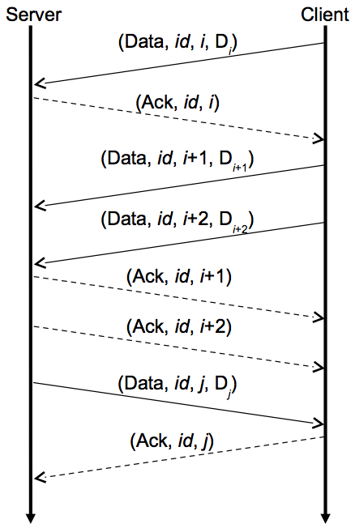

# Project 2: Distributed Bitcoin miner

This repository contains the instructions and the starter code for project 2. It also contains the tests that we will use to grade your implementation, and two simple echo server/client (`srunner` and `crunner`, respectively) programs that you might find useful for your own testing purposes. These instructions assume you have followed [these instructions](https://github.com/jnylam/cs189a) to install the course's repository.

If at any point you have any trouble with building, installing, or testing your code, the article titled [How to Write Go Code](http://golang.org/doc/code.html) is a great resource for understanding how Go workspaces are built and organized. You might also find the documentation for the [`go` command](http://golang.org/cmd/go/) to be helpful. As always, feel free to post your questions on Piazza.

This project will consist of the following two parts:

* Part A: Implement the Live Sequence Protocol, a homegrown protocol for providing reliable communication with simple client and server APIs on top of the Internet UDP protocol.
* Part B: Implement a Distributed Bitcoin Miner.

Table of contents:
<!-- TOC depthFrom:1 depthTo:6 withLinks:1 updateOnSave:1 orderedList:0 -->

- [Part A: LSP protocol](#part-a-lsp-protocol)
	- [LSP overview](#lsp-overview)
		- [Establishing a connection](#establishing-a-connection)
		- [Sending and acknowledging data](#sending-and-acknowledging-data)
		- [Epoch events](#epoch-events)
	- [LSP API](#lsp-api)
		- [LSP messages](#lsp-messages)
		- [LSP parameters](#lsp-parameters)
		- [LSP client API](#lsp-client-api)
		- [LSP server API](#lsp-server-api)
	- [Starter code](#starter-code)
	- [Testing your code using `srunner` and `crunner`](#testing-your-code-using-srunner-and-crunner)
	- [Running the tests](#running-the-tests)
	- [Submitting part A](#submitting-part-a)
- [Part B: Distributed Bitcoin miner](#part-b-distributed-bitcoin-miner)
	- [Bitcoin overview](#bitcoin-overview)
	- [System architecture](#system-architecture)
		- [Sequence of events](#sequence-of-events)
		- [Handling failures](#handling-failures)
	- [Starter code](#starter-code)
	- [Importing the `bitcoin` package](#importing-the-bitcoin-package)
	- [Compiling the `client`, `miner` and `server` programs](#compiling-the-client-miner-and-server-programs)
	- [Submitting part B](#submitting-part-b)
- [Project requirements](#project-requirements)
- [Reading the API documentation](#reading-the-api-documentation)
- [Acknowledgments](#acknowledgments)

<!-- /TOC -->

## Part A: LSP protocol

We will begin by discussing part A of this project, in which you will implement the _Live Sequence Protocol_. In your implementation, you will incorporate features required to create a robust system, handling lost or duplicated Internet packets, as well as failing clients and servers. You will also learn the value of creating a set of layered abstractions in bridging between low-level network protocols and high-level applications.

The low-level Internet Protocol (IP) provides what is referred to as an “unreliable datagram” service, allowing one machine to send a message as a packet to another, but with the possibility that the packet will be delayed, dropped, or duplicated. In addition, as an IP packet hops from one network node to another, its size is limited to a specified maximum number of bytes. Typically, packets of up to 1,500 bytes can safely be transmitted along any routing path, but going beyond this can become problematic.

Very few applications use IP directly. Instead, they are typically written to use UDP or TCP:

__UDP:__ The “User Datagram Protocol.” Also an unreliable datagram service, but it allows packets to be directed to different logical destinations on a single machine, known as ports. This makes it possible to run multiple clients or servers on a single machine. This function is often called multiplexing.

__TCP:__ The “Transmission Control Protocol” offers a reliable, in-order stream abstraction. Using TCP, a stream of arbitrary-length messages is transmitted by breaking each message into (possibly multiple) packets at the source and then reassembling them at the destination. TCP handles such issues as dropped packets, duplicated packets, and preventing the sender from overwhelming both Internet bandwidth and the buffering capabilities at the destination.

Your task for Part A of this project is to implement the Live Sequence Protocol (LSP). LSP provides features that lie somewhere between UDP and TCP, but it also has features not found in either protocol:

* Unlike UDP or TCP, it supports a client-server communication model.
* The server maintains connections between a number of clients, each of which is identified by a numeric connection identifier.
* Communication between the server and a client consists of a sequence of discrete messages in each direction.
* Message sizes are limited to fit within single UDP packets (around 1,000 bytes).
* Messages are sent reliably: a message sent over the network must be received exactly once, and messages must be received in the same order they were sent.
* The server and clients monitor the status of their connections and detect when the other side has become disconnected.

The following sections will describe LSP in-depth. We begin by describing the protocol in terms of the messages that flow between the server and its clients.

### LSP overview

In LSP, communication between a server and client consists of a sequence of discrete messages sent in each direction. Each message sent over an LSP connection is made up of the following four values:

* __Message Type:__ An integer constant identifying one of three possible message types:
	*	__Connect:__ Sent by a client to establish a connection with the server.
	*	__Data:__ Sent by either a client or the server to transmit information.
	*	__Ack:__ Sent by either a client or the server to acknowledge a Connect or Data message.
* __Connection ID:__ A positive, non-zero number that uniquely identifies the client-server connection.
* __Sequence Number:__ A positive, non-zero number that is incremented with each data message sent, starting with the number 0 for the initial connection request.
* __Payload:__ A sequence of bytes, with a format determined by the application.

In the sections that follow, we will use the following notation to indicate the different possible messages that can be sent between a client and a server (note that both Connect and Ack messages have payload values of `nil`):

* (Connect, 0, 0): Connection request. It must have ID 0 and sequence number 0.
* (Data,id,sn,D): Data message with ID id, sequence number sn, and payload D.
* (Ack,id,sn): Ack message with ID id, and sequence number sn.

#### Establishing a connection

Before data can be sent between a client and server, a connection must first be made. The client initiates a connection by sending a connection request to the server. In response, the server generates and assigns an ID that uniquely identifies the new client-server connection, and sends the client an acknowledgment message containing this new ID, the sequence number 0, and a `nil` payload.


This figure illustrates the establishment of a connection: A client sends a connection request to the server, which responds to the client with an acknowledgment message containing the connection’s unique ID. The vertical lines with downward arrows denote the passage of time on both the client and the server, while the lines crossing horizontally denote messages being sent between the two.

Your server may choose any scheme for generating new connection IDs. Our implementation simply assigns IDs sequentially starting with 1.

#### Sending and acknowledging data

Once a connection is established, data may be sent in both directions (i.e. from client to server or from server to client) as sequences of discrete data messages.

Here is an example of a normal communication sequence between the server and a client.



This figure illustrates the transmission of three data messages from the client to the server, and one data message from the server to the client. Note that all messages are acknowledged, and that the client and server maintain their own series of sequence numbers, independent of the other. Also note that it is entirely possible for one side to receive data messages from the other as it is waiting for these acknowledgments—the client and server operate asynchronously, and there is no guarantee that packets arrive in the same order they are sent.

Like TCP, LSP includes a sliding window protocol. The sliding window represents an upper bound on the range of messages that can be sent without acknowledgment. This upper bound is referred to as the “window size,” which we denote _w_. For example, if _w_ = 1, every message must be acknowledged before the next message can be sent. If _w_ = 2, up to two messages can be sent without acknowledgment. That is, a third message cannot be sent until the first message is acknowledged, a fourth message cannot be sent until the first and second messages are acknowledged, etc.

Note that the range of messages that are allowed to be sent without acknowledgment is fixed. If the oldest message that has not yet been acknowledged has sequence number n, then only messages with sequence numbers n through n + _w_ - 1 (inclusive) may be sent. Only when the oldest (leftmost) messages are acknowledged can the window slide over to the right, possibly allowing more recent data messages to be sent.

In addition to maintaining a sliding window for non-acknowledged data messages, both clients and servers will also need to maintain a sliding window for their _w_ most recently sent acknowledgments, as they might need to be re-sent at a later time (you may assume that both the client and server will have the same window sizes). The reasons for this additional book-keeping will become clear in the next section, in which we discuss _epoch events_.

#### Epoch events

Unfortunately, the basic protocol described so far is not robust. On one hand, its sequence numbers makes it possible to detect when a message has been dropped or duplicated. However, if any message&mdash;connection request, data message, or acknowledgment&mdash;gets dropped, the linkage in either one or both directions will stop working, with both sides waiting for messages from the other.

To make LSP robust, we incorporate a simple time trigger into the servers and clients. Timers fire periodically on both the clients and servers, dividing the flow of time for each into a sequence of _epochs_. We refer to the time interval between epochs as the epoch duration, denoted with _d_. Our default value for _d_  is 2,000 milliseconds, although this can be varied.

When the epoch timer fires, a client takes the following actions:

* If the client’s connection request has not yet been acknowledged by the server, then resend the connection request.
* If the connection request has been sent and acknowledged, but no data messages have been received, then send an acknowledgment with sequence number 0.
* For each data message that has been sent but not yet acknowledged, resend the data message.
* Resend an acknowledgment message for each of the last _w_ (or possibly fewer) distinct data messages that have been received.

The server performs a similar set of actions for each of its connections:

* If no data messages have been received from the client, then resend an acknowledgment message for the client’s connection request.
* For each data message that has been sent, but not yet acknowledged, resend the data message.
* Resend an acknowledgment message for each of the last _w_ (or possibly fewer) distinct data messages that have been received.


This figure illustrates how the epoch events make up for failures by the normal communication. We show the occurrence of an epoch event as a large black oval on each time line. In this example, the client attempts to send data D<sub>i</sub>, but the acknowledgment message gets dropped. In addition, the server attempts to send data D<sub>j</sub>, but the data message gets dropped. When the epoch timer triggers on the client, it will send an acknowledgment of data message j - 1, the last data message received, and it will resend data D<sub>i</sub>.

Assuming the server has an epoch event around the same time (there is no requirement that they occur simultaneously), we can see that the server will send an acknowledgment for data D<sub>i</sub>, and it will resend data D<sub>j</sub>.

We can see in this example that duplicate messages can occur: for example, the server might receive two copies of D<sub>i</sub>. For most cases, we can use sequence numbers to detect any duplications: Each side maintains a counter indicating which sequence number it expects next and discards any message that does not match the expected window range of sequence numbers. One case of duplication requires special attention, however: it is possible for the client to send multiple connection requests, with one or more requests or acknowledgments being dropped. The server must track the host address and port number of each connection request and discard any for which that combination of host and port already has an established connection.

One feature of this epoch design is that there will be at least one message transmitted in each direction between client and server on every epoch. As a final feature, we will track at the endpoint of each connection the number of epochs that have passed since a message (of any type) was received from the other end. Once this count reaches a specified epoch limit, which we denote with the symbol _K_, we will declare that the connection has been lost. Our implementation uses a default value of 5 for _K_; thus, if nothing is received from the other end of an established connection over a total period of _Kd_ seconds, then the connection should be assumed lost.

### LSP API

We will now describe LSP from the perspective of a Go programmer. You must implement the _exact_ API discussed below to facilitate automated testing, and to ensure compatibility between different implementations of the protocol.

The LSP API can be found in the `lsp` package (included as part of the starter code). This file defines several exported structs, interfaces, and constants, and also provides detailed documentation describing the intent and expected behavior of every aspect of the API. Consult it regularly!

#### LSP messages

The different LSP message types are defined as integer constants below:
```go
type MsgType int
const (
        MsgConnect MsgType = iota // Connection request from client.
        MsgData                   // Data message from client or server.
        MsgAck                    // Acknowledgment from client or server.
)
```

Each LSP message consists of four fields, and is declared as a Go struct:

```go
type Message struct {
        Type    MsgType // One of the message types listed above.
        ConnID  int     // Unique client-server connection ID.
        SeqNum  int     // Message sequence number.
        Payload []byte  // Data message payload.
}
```

To send a `Message` over the network, you must first convert the structure to a UDP packet by marshalling it into a sequence of bytes. This can be done in Go using the `Marshal` function in the `json` package.

#### LSP parameters

For both the client and the server, the API provides a mechanism to specify the epoch limit _K_, the epoch duration _d_, and the sliding window size _w_ when a client or server is first created. These parameters are encapsulated in the following `struct`:

```go
type Params struct {
        EpochLimit  int // Default value is 5.
        EpochMillis int // Default value is 2000.
        WindowSize  int // Default value is 1.
}
```

#### LSP client API

An application calls `the NewClient` to set up and initiate the activities of a client. The function blocks until a connection with the server has been made, and returns a non-`nil` error if the connection could not be established. The function is declared as follows:

```go
func NewClient(hostport string, params *Params) (Client, error)
```

The LSP client API is defined by the `Client` interface, which declares the methods below:

```go
ConnID() int
Read() ([]byte, error)
Write(payload []byte) error
Close() error
```

The `Client` interface hides all of the details of establishing a connection, acknowledging messages, and handling epochs from the application programmer. Instead, applications simply read and write data messages to the network by calling the `Read` and `Write` methods respectively. The connection can be signaled for shutdown by calling `Close`.

A few other details are worth noting:

* `Read` should block until data has been received from the server and is ready to be returned. It should return a non-`nil` error if either (1) the connection has been explicitly closed, or (2) the connection has been lost due to an epoch timeout and no other messages are waiting to be returned by `Read`.
* `Write` should not block. It should return a non-nil error only if the connection to the server has been lost.
* Close should not forcefully terminate the connection, but instead should block until all pending messages to the server have been sent and acknowledged (of course, if the connection is suddenly lost during this time, the remaining pending messages should simply be discarded).
* No goroutine should be left running after `Close` has returned.
* You may assume that Read, Write, and Close will not be called after `Close` has been called.

For detailed documentation describing the intent and expected behavior of each function and method, consult the `client_api.go` and `client_impl.go` files.

#### LSP server API

The API for the server is similar to that for an LSP client, with a few minor di↵erences. An application calls the `NewServer` to set up and initiate a LSP server. However, unlike `NewClient`, this function should not block. Instead, it should simply begin listening on the specified port and spawn one or more goroutines to handle things like accepting incoming client connections, triggering epoch events at fixed intervals, etc. If there is a problem setting up the server, the function should return a non-`nil` error. The function is declared as follows:

```go
func NewServer(port int, params *Params) (Server, error)
```

The LSP server API is defined by the `Server` interface, which declares the following methods:

```go
Read() (int, []byte, error)
Write(connID int, payload []byte) error
CloseConn(connID int) error
Close() error
```

Similar to the `Client`, the `Server` interface allows applications to both read and right data to its clients. Note, however, that because the server can be connected to several LSP clients at once, the `Write` and `CloseConn` methods take a client’s unique connection ID as an argument, indicating the connection that should be written to or that should be closed.

A few other details are worth noting:

* `Read` should block until data has been received from some client and is ready to be returned. It should return a non-nil error if either (1) the connection to some client has been explicitly closed, or (2) the connection to some client has been lost due to an epoch timeout and no other messages from that client are waiting to be returned by `Read`. This method should not return data from a connection that was explicitly closed by a call to `CloseConn`.
* The `Write` and `CloseConn` methods should not block, and should both return a non-`nil` error value only if the specified connection ID does not exist.
* `Close` should block until all pending messages to each client have been sent and acknowledged (of course, if a client that still has pending messages is suddenly lost during this time, the remaining pending messages should simply be discarded).
* No goroutine should be left running after `Close` has returned.
* You may assume that after `CloseConn` has been called, neither `Write` nor `CloseConn` will be called on that same connection ID again. You may also assume that no other `Server` methods calls will be made after `Close` has been called.

For detailed documentation describing the intent and expected behavior of each function and method, consult the `server_api.go` and `server_impl.go` files.

### Starter code

To download or update the codebase for this class, follow [these instructions](https://github.com/jnylam/cs189a).

Next, move the included binaries in project 2 to Go's bin directory:

```sh
mv $GOPATH/src/github.com/jnylam/cs189a/project2/bin/* $GOPATH/bin/
```

The starter code for part A of this project can be found in the `github.com/jnylam/cs189a/project2/` directory, and is organized as follows:

* The `lsp` package contains the API, tests, and the starter code you will need to complete:
	*	The `client_api.go`, `server_api.go`, `message.go`, and `params.go` files collectively define the LSP API. To facilitate automated testing, you must not modify these files.
	* The `client_impl.go` file contains a skeletal implementation of the `Client` that you will write
	* The `server_impl.go` file contains a skeletal implementation of the `Server` that you will write.
	* The `*_test.go` files contain the tests that we will run to test and evaluate your final submission.
* The `lspnet` package contains all of the UDP operations you will need to complete this assignment. Under-the-hood, the `lspnet` package provides some additional functionalities that allow us to more easily grade the robustness of your implementation.
* The `srunner` (server-runner) and `crunner` (client-runner) packages each provide simple executable programs that you may use for your own testing purposes.

### Testing your code using `srunner` and `crunner`

To make testing your server a bit easier we have provided two simple echo server/client programs called `srunner` and `crunner`. If you look at the source code for the two programs, you'll notice that they import the `github.com/jnylam/cs189a/project2/lsp` package (in other words, they compile against the current state of your LSP implementation). We believe you will find these program useful in the early stages of development when your client and server implementations are largely incomplete.

To compile, build, and run these programs, use the `go run` command from inside the directory storing the file:

```bash
go run srunner.go
```

The `srunner` and `crunner` programs may be customized using command line flags. For more
information, specify the `-h` flag at the command line. For example,

```bash
$ go run srunner.go -h
Usage of bin/srunner:
  -elim=5: epoch limit
  -ems=2000: epoch duration (ms)
  -port=9999: port number
  -rdrop=0: network read drop percent
  -v=false: show srunner logs
  -wdrop=0: network write drop percent
  -wsize=1: window size
```

We have also provided pre-compiled executables for you to use called `srunner-sols` and `crunner-sols`. These binaries were compiled against our reference LSP implementation, so you might find them useful in the early stages of the development process (for example, if you wanted to test your `Client` implementation but haven't finished implementing the `Server` yet, etc.). Two separate binaries are provided for Linux and Mac OS X machines (Windows is not supported at this time).

As an example, to start an echo server on port `6060`, execute the following command:

```sh
$GOPATH/bin/linux_amd64/srunner-sols -port=6060
```

### Running the tests

To test your submission, we will execute the following command from inside the
`github.com/jnylam/cs189a/project2/lsp` directory for each of the tests (where `TestName` is the name of one of the 44 test cases, such as `TestBasic6` or `TestWindow1`):

```sh
go test -run=TestName
```

Note that we will execute each test _individually_ using the `-run` flag and by specify a regular expression identifying the name of the test to run. To ensure that previous tests don't affect the outcome of later tests, we recommend executing the tests individually (or in small batches, such as `go test -run=TestBasic` which will execute all tests beginning with `TestBasic`) as opposed to all together using `go test`.

On some tests, we will also check your code for race conditions using Go's race detector:

```sh
go test -race -run=TestName
```

### Submitting part A

To submit your code, create a `lsp.tar` file containing your LSP implementation as follows:

```sh
cd $GOPATH/src/github.com/jnylam/cs189a/project2/
tar -cvf lsp.tar lsp/
```


## Part B: Distributed Bitcoin miner

In part B of this project, you will implement a simple distributed system using your LSP implementation you wrote in part A. Your system will harness the power of multiple processors to speed up a compute-intensive task and will be capable of recovering from sudden machine failures.

### Bitcoin overview

Bitcoin is a decentralized digital currency. At the heart of the Bitcoin protocol is a replay prevention mechanism that prevents participants from double spending Bitcoins. The replay prevention mechanism uses a cryptographic proof-of-work function that is designed to be computationally hard to execute. Clients compete to be the first to find a solution to the proof-of-work in order to get their signature attached to a sequence of transactions. If a client wins, they are rewarded with Bitcoins. The process of finding a solution to the proof-of-work is called mining.

In this project, we will spare you the details of the real Bitcoin protocol. You will instead implement a mining infrastructure based upon a simplified variant: given a message M and an unsigned integer N, find the unsigned integer n which, when concatenated with M, generates the _smallest_ hash value, for all 0 &le; n &le; N. Throughout this document, we will refer to each of these unsigned integers as a _nonce_.

As an example, consider a request with string message `"msg"` and maximum nonce `2`. We can determine the desired result by calculating the hash value for each possible concatenation. In this case, nonce 1 generated the least hash value, and thus the final result consists of least hash value `4754799531757243342` and nonce `1`. Note that you need not worry about the details of how these hash values are computed&mdash;we have provided a `Hash` function in the starter code for you to use to calculate these hashes instead.

* `bitcoin.Hash("msg", 0) = 13781283048668101583`
* `bitcoin.Hash("msg", 1) = 4754799531757243342`
* `bitcoin.Hash("msg", 2) = 5611725180048225792`

One simple approach to completing this task is to perform a brute-force search, in which we enumerate all possible scenarios across multiple machines. For tasks that require searching a large range of nonces, a distributed approach is certainly preferable over executing the compute-intensive task on a single machine. <!--As an example, our measurements show that a typical Andrew Linux machine can compute SHA-256 hashes at a rate of around 10,000 per second.--> Running sequentially, a brute force approach would require around 28 hours to try all possible hashes consisting of 9 decimal digits. But, if we could harness the power of 100 machines, then we could reduce this time to around 17 minutes.

Your task for this project is to implement a simple distributed system to perform this task. We discuss our proposed system design in the next section.

### System architecture

Your distributed system will consist of the following three components:

__Client__: An LSP client that sends a user-specified request to the server, receives and prints the result, and then exits.

__Miner__: An LSP client that continually accepts requests from the server, exhaustively computes all hashes over a specified range of nonces, and then sends the server the final result.

__Server__: An LSP server that manages the entire Bitcoin cracking enterprise. At any time, the server can have any number of workers available, and can receive any number of requests from any number of clients. For each client request, it splits the request into multiple smaller jobs and distributes these jobs to its available miners. The server waits for each worker to respond before generating and sending the final result back to the client.

Each of the three components communicate with one another using a set of predefined messages. The following table shows the types of messages that can be sent between the different system components.  In the “From–To” column, ‘M’ denotes a miner, ‘S’ denotes the server, and ‘C’ denotes a request client.

Type      | Fields             | From-to  | use
----------|--------------------|----------|--------------------
`Join`    |                    | M-S      | miner's join request
`Request` | `Data Lower Upper` | C-S, S-M | send job request
`Result`  | `Hash Nonce`       | M-S, S-C | report job's final result

Each type of message is declared in the `message.go` file as a Go `struct`. As in part A, each message must first be marshalled into a sequence of bytes using Go’s `json` package.

#### Sequence of events

The overall operation of the system should proceed as follows:

* The server is started using the following command, specifying the port to listen on:
```
./server _port_
```

* One or more miners are started using the following command, specifying the server’s
address and port number separated by a colon:
```
./miner _host:port_
```

* When a miner starts, it sends a join request message to the server, letting the server know that it is ready to receive and execute new job requests. New miners may start up and send join requests to the server at any time.

* The user makes a request to the server by executing the following command, specifying the server’s address and port number, the message to hash, and the maximum nonce to check:
```
./client _host:port_ _message_ _maxNonce_
```
The client program should generate and send a request message to the server, specifying lower nonce “0” and maximum nonce “maxNonce”:
```
[Request message 0 maxNonce]
```

* The server breaks this request into more manageable-sized jobs and farms them out to its available miners (it is up to you to choose a suitable maximum job size). Once the miner exhausts all possible nonces, it determines the least hash value and its corresponding nonce and sends back the final result:
```
[Result _minHash_ _nonce_]
```

* The server collects all final results from the workers, determines the least hash value
and its corresponding nonce, and sends back the final result to the request client.

The request client should print the result of each request to standard output as follows (note that you must match this format precisely in order for our automated tests to work):

* If the server responds with a final result, it should print,
```
Result _minHash_ _nonce_
```
where `minHash` and `nonce` are the values of the lowest hash and its corresponding nonce, respectively.

* If the request client loses its connection with the server, it should simply print
```
Disconnected
```

#### Handling failures

We will assume that the server operates all the time, but it is quite possible that a request client or some of the miners can drop out. You should take the following actions when different system components fail:

* When a miner loses contact with the server it should shut itself down.
* When the server loses contact with a miner, it should reassign any job that the worker was handling to a different worker. If there are no available miners left, the server should wait for a new miner to join before reassigning the old miner’s job.
* When the server loses contact with a request client, it should cease working on any requests being done on behalf of the client (you need not forcibly terminate a job on a miner&mdash;just wait for it to complete and ignore its results).
* When a request client loses contact with the server, it should print `Disconnected` to standard output and exit.

Your server will need to implement a _scheduler_ to efficiently assign workers to incoming client requests. You should design a scheduler that balances loads across all requests, so that the number of workers assigned to each outstanding request is roughly equal. Your code should contain documentation on how your scheduler achieves this requirement.

### Starter code

The starter code for part B of this project can be found in the `bitcoin/` directory, and is organized as follows:

* The `message.go` file defines the message types you will need to implement your system.
* The `hash.go` file defines a `Hash` function that your miners should use to compute
`uint64` hash values.
* The `client/client.go` file is where you will implement your request client program.
* The `miner/miner.go` file is where you will implement your miner program.
* The `server/server.go` file is where you will implement your server program.

We have also provided three binaries (`ctest`, `mtest`, and `stest`) for you to use to test your implementation. These binaries can be found in the project’s `bin/` directory.

### Importing the `bitcoin` package

In order to use the starter code we provide in the `hash.go` and `message.go` files, use the following `import` statement:

```go
import "github.com/jnylam/cs189a/project2/bitcoin"
```

Once you do this, you should be able to make use of the `bitcoin` package as follows:

```go
hash := bitcoin.Hash("thom yorke", 19970521)

msg := bitcoin.NewRequest("jonny greenwood", 200, 71010)
```

### Compiling the `client`, `miner` and `server` programs

To compile the `client`, `miner`, and `server` programs, use the `go install` command
as follows (these instructions assume your
`GOPATH` is pointing to the project's root `project2/` directory):

```bash
# Compile the client, miner, and server programs. The resulting binaries
# will be located in the $GOPATH/bin directory.
go install github.com/jnylam/cs189a/project2/bitcoin/client
go install github.com/jnylam/cs189a/project2/bitcoin/miner
go install github.com/jnylam/cs189a/project2/bitcoin/server

# Start the server, specifying the port to listen on.
$GOPATH/bin/server 6060

# Start a miner, specifying the server's host:port.
$GOPATH/bin/miner localhost:6060

# Start the client, specifying the server's host:port, the message
# "bradfitz", and max nonce 9999.
$GOPATH/bin/client localhost:6060 bradfitz 9999
```

Note that you will need to use the `os.Args` variable in your code to access the user-specified command line arguments.

### Running the tests

Unlike in previous projects, the tests for part B will _not_ be open source. Instead, we have provided three binaries&mdash;`ctest`, `mtest`, and `stest`&mdash;for you to use to test your code. The tests are compiled for both Linux and Mac OS X machines (Windows is not supported at this time).

To execute the tests, make sure your `GOPATH` is properly set and then execute them as follows (note that you for each binary, you can activate verbose-mode by specifying the `-v` flag). _Make sure you compile your `client`, `miner`, and `server` programs using `go install` before running the tests!_

```bash
# Run ctest on a Mac OS X machine in non-verbose mode.
$GOPATH/bin/darwin_amd64/ctest

# Run mtest on a Linux machine in verbose mode.
$GOPATH/bin/linux_amd64/mtest -v
```

When you run the tests, one of the first things you'll probably notice is that none of the logs you print in both the code you write for part A and part B will not appear. This is because our test binaries must capture the output of your programs in order to test that your request clients print the correct result message to standard output at the end of each test. An alternative to logging messages to standard output is to use a `log.Logger` and direct them to a file instead, as illustrated by the code below:

```go
const (
	name = "log.txt"
	flag = os.O_RDWR | os.O_CREATE
	perm = os.FileMode(0666)
)

file, err := os.OpenFile(name, flag, perm)
if err != nil {
	return
}

LOGF := log.New(file, "", log.Lshortfile|log.Lmicroseconds)
LOGF.Println("Bees?!", "Beads.", "Gob's not on board.")
```

Don't forget to call `file.Close()` when you are done using it!

### Submitting part B

To submit your code, create a `project2.tar` file containing your part A and part B implementation as follows:

```sh
cd $GOPATH/src/jnylam/cs189a/project2/
tar -cvf project2.tar project2/
```

## Project requirements

As you write your code for this project, also keep in mind the following requirements:

* The project must be done individually. You must not use any code that you have not written yourself. As with all projects in this course, we will be using [Moss](http://theory.stanford.edu/~aiken/moss/) to detect software plagiarism (including comparisons with student submissions from past semesters).
* Your code must not use locks and mutexes. All synchronization must be done using goroutines, channels, and Go’s channel-based `select` statement.
* You must not use Go’s `net` package for this assignment. Instead, you should use the functions and methods in the `lspnet` package we have provided as part of the starter code for this project instead.
* Avoid using fixed-size buffers and arrays to store things that can grow arbitrarily in size. For example, do not use a buffered channel to store pending messages for a particular connection. Instead, use a linked list&mdash;such as the one provided by the `container/list` package&mdash;or some other data structure that can expand to an arbitrary size.
* You may assume that the UDP packets will not be corrupted, and that you do not need to check your messages for proper formatting (unless, of course, you want to defend against your own programming errors).
* You must format your code using `go fmt` and must follow Go’s standard naming conventions. See the [Formatting](https://golang.org/doc/effective_go.html#formatting) and [Names](https://golang.org/doc/effective_go.html#names) sections of Effective Go for details.

## Reading the API documentation

Before you begin the project, you should read and understand all of the starter code we provide. To make this experience a little less traumatic (we know, it's a lot :P), fire up a web server and read the documentation in a browser by executing the following command:

```sh
godoc -http=:6060 &
```

Then, navigate to [localhost:6060/pkg/github.com/jnylam/cs189a/project2/lsp](http://localhost:6060/pkg/github.com/jnylam/cs189a/project2/lsp) in a browser.
Note that you can execute this command from anywhere in your system.

## Acknowledgments

This assignment is based on a project given as part of [Distributed Systems](http://www.cs.cmu.edu/~dga/15-440/S14/index.html) taught by David Andersen and Srini Seshan.
